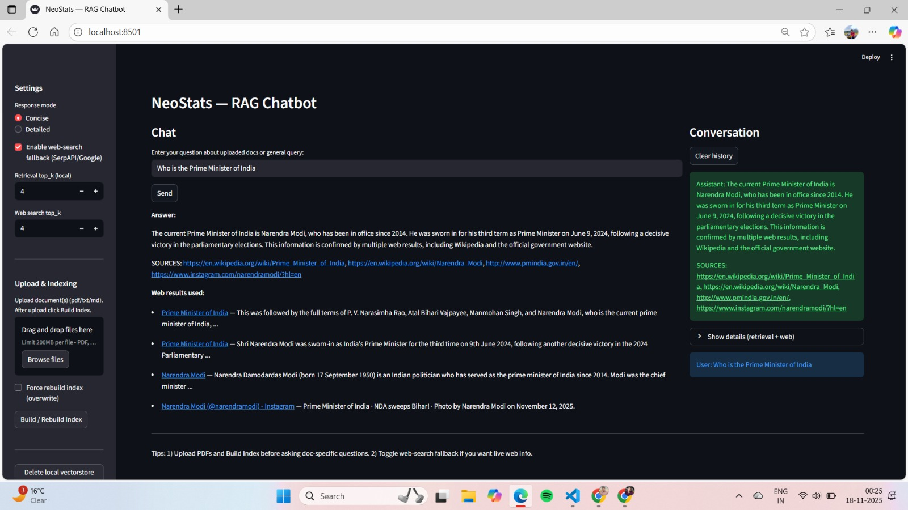
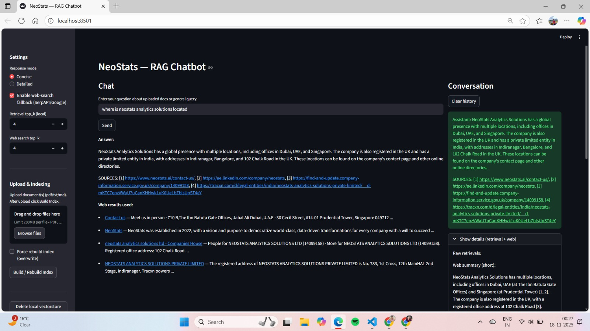

# 📘 NeoStats — AI RAG Chatbot (Groq + Vector Search + Web Search + Streamlit)

NeoStats is an **AI-powered Retrieval-Augmented Generation (RAG) chatbot** built using:

- **Groq LLMs (Llama-3.3-70B-Versatile)** → ultra-fast + free  
- **FAISS vector search** for local document retrieval  
- **Streamlit** for the web UI  
- **Custom document ingestion pipeline** (PDF/Text/Markdown)  
- **Web Search Fallback** (SerpAPI / Google CSE)  
- **Source-aware answers** with citations and provenance  

This app allows users to:

✔ Upload PDFs / TXT / MD files  
✔ Chunk + embed + index documents locally  
✔ Ask questions from the uploaded documents  
✔ Auto-fallback to web search when document info is missing  
✔ Chat with context-aware answers  
✔ View document chunk sources + web search links  
✔ Deploy instantly on Streamlit Cloud  

---

## 🌐 Live Demo (Add your link after deployment)
```
https://aman245002-rag-chatbot-app-hsodau.streamlit.app/
```

---
# 📸 Screenshots

### 🔹 Home Screen  


### 🔹 Chat + RAG Retrieval + Web Search Example  


## 📁 Project Structure

```
AI_UseCase/
│
├── app.py
├── requirements.txt
├── README.md
│
├── config/
│   └── config.py
│
├── models/
│   ├── llm.py
│   └── embeddings.py
│
├── utils/
│   ├── rag.py
│   ├── web_search.py
│   ├── vectorstore.py
│   └── doc_utils.py
│
├── uploads/          (auto-created)
└── vectorstore/      (auto-created)
```

---

## 🚀 Features

### 🔍 1. Local RAG Engine
- PDF/text parsing  
- Smart chunking  
- Embedding (OpenAI OR SentenceTransformer)  
- FAISS vector search  
- Metadata tracking (source, page, text)  
- Context construction + prompt generation  

### 🌐 2. Web Search Fallback  
If documents don’t contain the answer, the app auto-searches the web via:
- **SerpAPI** (recommended)
- **Google Custom Search API**

Then compresses results into a summary and merges into the RAG prompt.

### ⚡ 3. Groq LLM (Free + Fast)
Uses the **Groq Python SDK** or fallback HTTP requests:

Supported models:
- `llama-3.3-70b-versatile` (recommended)
- `llama-3.3-8b`
- `mixtral-8x7b`

### 💬 4. Clean Chat Interface
- Persistent chat history  
- Source citations (document chunks + web links)  
- Expandable debug view  
- Supports Concise / Detailed modes  

---

## 🛠️ Installation (Local)

### 1. Clone the repo
```bash
git clone https://github.com/aman245002/RAG_Chatbot
cd RAG_Chatbot
```

### 2. Create virtual environment
```bash
python -m venv venv
source venv/Scripts/activate     # Git Bash
# OR
venv\Scripts\activate          # CMD/PowerShell
```

### 3. Install dependencies
```bash
pip install -r requirements.txt
```

### 4. Add .env file 
```
GROQ_API_KEY=your_groq_key_here
DEFAULT_LLM=groq
GROQ_MODEL=llama-3.3-70b-versatile

# Optional (for web search)
SERPAPI_API_KEY=your_key
GOOGLE_API_KEY=your_key
GOOGLE_CX=search_engine_id
```

### 5. Run the app
```bash
streamlit run app.py
```

---

## 🌩️ Deployment on Streamlit Cloud

### 1. Push to GitHub:
```bash
git add .
git commit -m "Deploy NeoStats RAG Chatbot"
git push origin main
```

### 2. Go to:
🔗 https://share.streamlit.io  
→ Connect your GitHub repo  
→ Choose app.py  
→ Deploy  

### 3. Add Secrets in Streamlit
```
GROQ_API_KEY="your_key"
DEFAULT_LLM="groq"
GROQ_MODEL="llama-3.3-70b-versatile"

SERPAPI_API_KEY="your_key"
GOOGLE_API_KEY="your_key"
GOOGLE_CX="your_cx"
```

---

## 🧪 How to Use

### 1️⃣ Upload one or more PDFs/TXT/MD  
### 2️⃣ Click **“Build Index”**  
### 3️⃣ Ask questions in chat  
### 4️⃣ View:
- Document retrievals  
- Web search results  
- Sources  
- Debug chunk previews  

---

## 📌 Requirements

```
streamlit
python-dotenv
sentence-transformers
faiss-cpu
numpy
tqdm
transformers
pdfplumber
pypdf
requests
groq
openai
```

---

## 🧱 Troubleshooting

### ❌ 404 model_not_found
Use a Groq model name:
```
GROQ_MODEL=llama-3.3-70b-versatile
```

### ❌ 401 unauthorized
Your Groq API key is missing or wrong.

### ❌ 429 too many requests
You hit the Groq free tier limit — retry later.

---

